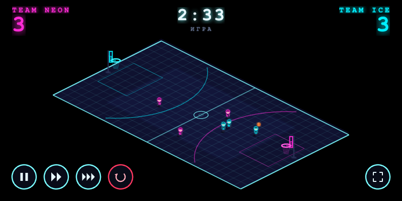

# 3 BASKET 3

Изометрическая сцена баскетбола 3 на 3 на Phaser 3. Чистый HTML/CSS/JS, без сборки.



**Просмотр онлайн:** https://vauweb.github.io/3b3/

## Запуск

Либо откройте страницу https://vauweb.github.io/3b3/ в браузере, либо локально — двойным кликом по `index.html` (работает по `file://`, офлайн).

Требуется современный браузер (Chrome/Edge/Firefox/Safari). Phaser подключён локально (`phaser.min.js`), спрайты генерируются в коде — никаких внешних файлов не нужно.

## Управление

- **Пауза** — пауза симуляции
- **Плей** — обычная скорость (x1)
- **x2 / x5** — ускорение симуляции
- **Сброс** — новый матч (обнуляет счёт и таймер)
- **Сыграть ещё** — кнопка в окне результата, перезапускает матч
- Горячие клавиши: `Space` — пауза/плей, `1/2/5` — скорость, `R` — сброс

## Особенности

- Вид: изометрия (диметрия 2:1), камера зафиксирована, видно всё поле
- Кольца слева и справа, корт слева направо
- 6 чиби-персонажей (3 розовых NEON vs 3 циан ICE), стиль киберпанк
- Каждый персонаж самостоятельно принимает решения каждый тик (Utility AI: роли защитник/нападающий/центр, взвешенный выбор действия)
- Анимация персонажей — программно сгенерированные спрайты (idle/run/shoot)
- Счёт и таймер матча (3:00) сверху
- Гол: +2 близко / +3 за дугой
- Адаптивное вписывание в экран (горизонтальная ориентация), центрирование сцены
- Без звука

## Структура

```
2b2/
├── index.html          # разметка, HUD, кнопки, подключение скриптов
├── styles.css          # киберпанк-стиль UI
├── phaser.min.js       # локальная копия Phaser 3
├── README.md
└── src/
    ├── config.js       # константы: поле, палитра, роли, скорости, тайминги
    ├── iso.js          # изометрическая проекция, вписывание в экран, y-sort
    ├── sprites.js      # генерация текстур (чиби, мяч, тень) через canvas
    ├── entities.js     # классы Player / Ball / Hoop (ручная физика в tile-пространстве)
    ├── ai.js           # Utility AI (взвешенный выбор действий)
    ├── scene.js        # GameScene: корт, симуляция, голы, таймер
    ├── ui.js           # HUD и кнопки (DOM)
    └── main.js         # создание Phaser.Game, адаптивный масштаб
```
